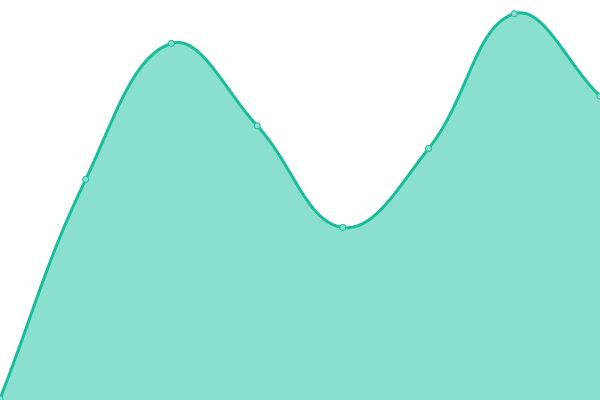

# [📈 Live Status](https://status.jasoncameron.dev): <!--live status--> **🟩 All systems operational**

This repository contains the open-source uptime monitor and status page for [Jason](https://jasoncameron.dev), powered by [Upptime](https://github.com/upptime/upptime).

With [Upptime](https://upptime.js.org), you can get your own unlimited and free uptime monitor and status page, powered entirely by a GitHub repository. We use [Issues](https://github.com/JasonLovesDoggo/status/issues) as incident reports, [Actions](https://github.com/JasonLovesDoggo/status/actions) as uptime monitors, and [Pages](https://status.jasoncameron.dev) for the status page.

<!--start: status pages-->
<!-- This summary is generated by Upptime (https://github.com/upptime/upptime) -->
<!-- Do not edit this manually, your changes will be overwritten -->
<!-- prettier-ignore -->
| URL | Status | History | Response Time | Uptime |
| --- | ------ | ------- | ------------- | ------ |
|  [Portfolio](https://jasoncameron.dev) | 🟩 Up | [portfolio.yml](https://github.com/JasonLovesDoggo/status/commits/HEAD/history/portfolio.yml) | 

 167ms
     
 | 

<a href="https://status.jasoncameron.dev/history/portfolio">100.00%</a>
    

|  [Foodle](https://jasoncameron.dev/foodle/) | 🟩 Up | [foodle.yml](https://github.com/JasonLovesDoggo/status/commits/HEAD/history/foodle.yml) | 

 36ms
     
 | 

<a href="https://status.jasoncameron.dev/history/foodle">100.00%</a>
    

|  [Metropolis](https://maclyonsden.com) | 🟩 Up | [metropolis.yml](https://github.com/JasonLovesDoggo/status/commits/HEAD/history/metropolis.yml) | 

 483ms
     
 | 

<a href="https://status.jasoncameron.dev/history/metropolis">100.00%</a>
    

|  [Metropolis Client](https://client.maclyonsden.com/) | 🟩 Up | [metropolis-client.yml](https://github.com/JasonLovesDoggo/status/commits/HEAD/history/metropolis-client.yml) | 

 160ms
     
 | 

<a href="https://status.jasoncameron.dev/history/metropolis-client">100.00%</a>
    

|  [Metropolis Client Prod](https://client-mock.maclyonsden.com/) | 🟩 Up | [metropolis-client-prod.yml](https://github.com/JasonLovesDoggo/status/commits/HEAD/history/metropolis-client-prod.yml) | 

 136ms
     
 | 

<a href="https://status.jasoncameron.dev/history/metropolis-client-prod">100.00%</a>
    

|  [Metropolis Doodle](https://doodle.maclyonsden.com/) | 🟩 Up | [metropolis-doodle.yml](https://github.com/JasonLovesDoggo/status/commits/HEAD/history/metropolis-doodle.yml) | 

 141ms
     
 | 

<a href="https://status.jasoncameron.dev/history/metropolis-doodle">100.00%</a>
    

|  [Status page (this page)](https://status.jasoncameron.dev) | 🟩 Up | [status-page-this-page.yml](https://github.com/JasonLovesDoggo/status/commits/HEAD/history/status-page-this-page.yml) | 

 159ms
     
 | 

<a href="https://status.jasoncameron.dev/history/status-page-this-page">100.00%</a>
    

<!--end: status pages-->

[**Visit our status website →**](https://status.jasoncameron.dev)

## 📄 License

- Powered by: [Upptime](https://github.com/upptime/upptime)
- Code: [MIT](./LICENSE) © [Jason](https://jasoncameron.dev)
- Data in the `./history` directory: [Open Database License](https://opendatacommons.org/licenses/odbl/1-0/)
